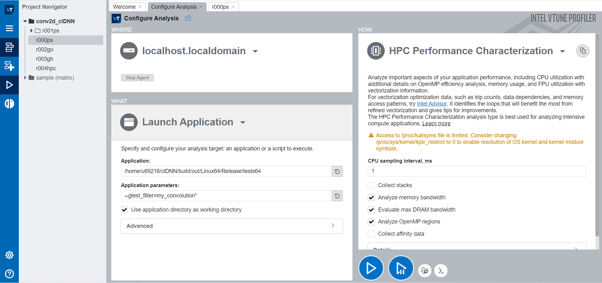

# Convolution Tutorial

> Lianwei Cui, Peking University, lianweicui@uchicago.edu
>
> 8/19/2021

## Environment Setting

All the configurations below are tested at Devcloud, with Intel HD Graphics P630(GEN 9 compute node).

#### Enable T2X Compiler

T2X can compile our kernel specification to CM code. Please Follow the instructions at [T2X](https://gitlab.com/T2S/t2s-os/) set the environment. From a T2X specification, we can get a genx.cpp file as the kernel code, which can be used at performance test section.

#### Install Intel C for Metal Development Package

Intel C for Metal Development Package is used to deploy our CM kernel on GPU.  If you need more details, please visit [c-for-metal-development-package](https://01.org/c-for-metal-development-package/downloads/linuxcformetaldevelopmentpackage20200119). Here we just give an example about how to launch our CM kernel generated by last step.

1. Download Linux C for metal Development Package and unzip it

```bash
wget https://github.com/intel/cm-compiler/releases/download/Master/Linux_C_for_Metal_Development_Package_20200119.zip
unzip Linux_C_for_Metal_Development_Package_20200119.zip
```

2. Chmod the cmc complier as executable

```bash
cd ~/Linux_C_for_Metal_Development_Package_20200119
chomd +x compiler/bin/cmc
```

3. Install Intel Media Driver for VAAPI and Intel Graphics Compiler. If you have root authority, you can just run drivers/install.sh and go step 4. 

   Here since we don't have root authority at Devcloud, we have to install the two packages manually. Thus please first unzip Intel Media Driver for VAAPI and Intel Graphics Compiler. 

```bash
cd ~/Linux_C_for_Metal_Development_Package_20200119/drivers/media_driver/release
mkdir extract
dpkg -X intel-media-u18.04-release.deb extract/

cd ~/Linux_C_for_Metal_Development_Package_20200119/drivers/IGC
mkdir extract
dpkg -X intel-igc.deb extract/
```

Then modify examples/Makefile.linux.

```bash
cd ~/Linux_C_for_Metal_Development_Package_20200119/examples
vim Makefile.linux
```

Modify the following two variables:

```bash
INCL          := -I$(CM_ROOT)/runtime/include -I.. -I$(CM_ROOT)/drivers/media_driver/release/extract/usr/include

HW_LDFLAGS      := -L$(CM_ROOT)/drivers/media_driver/release/extract/usr/lib/x86_64-linux-gnu -L/$(CM_ROOT)/drivers/IGC/extract/usr/local/lib -L$(CM_ROOT)/drivers/media_driver/release/extract/usr/lib/x86_64-linux-gnu/dri -lva -ldl -fPIC
```

4. Build and run linear_walker example:

```bash
cd ~/Linux_C_for_Metal_Development_Package_20200119/examples/linear_walker
make -f ../Makefile.linux
```

If you install the two packages manually, to run the example

```
LD_LIBRARY_PATH=~/Linux_C_for_Metal_Development_Package_20200119/drivers/media_driver/release/extract/usr/lib/x86_64-linux-gnu LIBVA_DRIVERS_PATH=~/Linux_C_for_Metal_Development_Package_20200119/drivers/media_driver/release/extract/usr/lib/x86_64-linux-gnu/dri ./hw_x64.linear_walker
```

Otherwise, you can run the examples directly

```bash
./hw_x64.linear_walker
```

#### Configure VTune at Devcloud(Optional)

VTune can be used to do performance analysis.

1. Register at [DevCloud](https://software.intel.com/content/www/us/en/develop/tools/devcloud/fpga.html). Then write a ssh config file(~/.ssh/config) like this. Here our User ID is u69216 and we choose s001-n171 as our compute node. Please replace "s001-n171.aidevcloud" with your own compute node name  if you want to run your tests on other machine.

```bash
Host devcloud
User u69216
IdentityFile ~/.ssh/devcloud-access-key-69216.txt
ProxyCommand ssh -T -i ~/.ssh/devcloud-access-key-69216.txt guest@devcloud.intel.com

Host s001-n171.aidevcloud
User u69216
IdentityFile ~/.ssh/devcloud-access-key-69216.txt
ProxyCommand ssh -T devcloud nc %h %p
LocalForward 5022 localhost:22
LocalForward 5901 localhost:5901
LocalForward 8081 localhost:8081
```

2. Open a terminal and login into the compute node. Then run vtune-backend on port 8081.

```bash
ssh devcloud
qsub -I -l nodes=s001-n171:ppn=2
vtune-backend --web-port=8081
```

​	The console will print an URL that includes a one-time token

```bash
 https://127.0.0.1:8081?one-time-token=<token> 
```

3. Open another ternimal and forwards your connection to the compute node

```
ssh s001-n171.aidevcloud
```

4. Open the VTune URL from step 2 in the local web browser and set a passphrase.

5. Configure VTune Agent. 

   ```
   Username: your devcloud user name
   Port: your local forward port configured in the ssh config file. Here is 22.
   Private key: Your private ssh key get from Devcloud.
   ```

   

   

6. Configure your application

   

7. Analyze the kernel


## Basic Design

Convolution can be expressed as：
$$
z(b,co,h,w)=\sum_{r_{kh}, r_{kw}, r_{ci}}x(b,ci,h+r_{kh},w+r_{kw})*y(co,ci,r_{kh},r_{kw})
$$
T2X uses UREs to express a compute. We choose conv3-64 in VGG-16 as our example and the basic convolution compute can be expressed as:

```c++
#define LAYOUT_X    TOTAL_W, TOTAL_H*R_CI *B
#define LAYOUT_Y    R_KW, R_KH, R_CI, CO
#define LAYOUT_O    W, H, CO, B

#define P 	 r_kw, r_kh, r_ci, w, h, co, b
#define P_X  w+r_kw, (h+r_kh)+r_ci*TOTAL_H+b*TOTAL_H*R_CI
#define P_Y  r_kw, r_kh, r_ci, co
#define OUT         w, h, co, b

#define P_kw__1     r_kw-1,      r_kh,        r_ci,   w, h, co, b
#define P_kh__1     r_kw+R_KW-1, r_kh-1,      r_ci,   w, h, co, b
#define P_ci__1     r_kw+R_KW-1, r_kh+R_KH-1, r_ci-1, w, h, co, b
    
    ImageParam x(Float(32), 2), y(Float(32), 4);
    x.set(new_data_2D<float, LAYOUT_X>(VALUES::SEQUENTIAL));
    y.set(new_data_4D<float, LAYOUT_Y>(VALUES::SEQUENTIAL));

    Var P,  
    Func X, Y, out, Z(Float(32), { P });

    X(P) = x(P_X);
    Y(P) = y(P_Y);
    Z(P) = select(r_kw != 0, 
    			Z(P_kw__1),
                select(r_kh != 0, 
                	Z(P_kh__1),
                    select(r_ci != 0, Z(P_ci__1), 0) 
                )
            ) 
            + X(P) * Y(P);
    out(OUT) = select(r_kw == R_KW - 1 && r_kh == R_KH - 1 && r_ci == R_CI - 1, Z(P));
```

Compile the specification to CM code:

```bash
cd ~/t2s-gpu-os-merge-main-repo/t2s/tests/correctness/GPU
g++ 2dconv-basic.cpp -g -std=c++11  -I../../../../Halide/include -I../../util/ -L../../../../Halide/bin -lHalide -lpthread -ldl
LD_LIBRARY_PATH=../../../../Halide/bin ./a.out
```

We might get a message like this:

```bash
terminate called after throwing an instance of 'Halide::CompileError'
  what():  Error: (at ./2dconv-basic.cpp:76) Total size for allocation Z is constant but exceeds 2^31 - 1.
```

To trace this problem, we let T2X dump out the IR:

```bash
HL_DEBUG_CODEGEN=4 LD_LIBRARY_PATH=../../../../Halide/bin ./a.out >& log.txt
```

And we can see the intermediate code:

```c++
Lowering after creating overlay scheduler:
...
allocate Z[...]
allocate Y[...]
allocate X[...]
...
```

There is no parallelism in current realization, and T2X will directly create buffers to hold all data of X, Y and Z. Thus, our global memory is obviously insufficient when convolution sizes are huge.

## Tiling

To address the issue above and make better use of parallelism of GPU. we must do tiling.

In Intel GPU, the basic execution unit is EU thread(HW thread). In fact, genx.cpp file just describes how a HW thread load data, do computing and store the results. There are two parallel dimensions: block and thread.  In [Gen 9 GPU](https://software.intel.com/content/dam/develop/external/us/en/documents/the-compute-architecture-of-intel-processor-graphics-gen9-v1d0.pdf), a block is corresponding to a subslice and a thread is corresponding to a HW thread. Since there are only 56 EU threads in a subslice, the number of threads in a block cannot be greater than 56.

To fit the two parallel dimensions, W and H of the output Z can be tiled twice. First, Z is divided by loop w and h into tiles so that a tile fits a subslice. Second, a tile is further divided by loop ww and hh into sub-tiles so that a sub-tile fits the a HW thread.

Besides, To improve parallelism, we also tile loop co to loop coo and coi. Then put loop b and loop coo into block dimension. The final tiling and parallelism scheme is as below

```c++
CO: coi coo
R_CI: r_cii r_cio
W: www ww w
H: hhh hh h

blocks:{w_coo, h_b}
thread:{ww, hh}
```

### Software Systolic Array

In the previous step, we assign original tasks to threads. Now we need to optimize for a single thread.

In our design, we use SIMD lanes as PEs and build a software systolic array. We should map the innermost space loop to SIMD lanes so this loop extent must match SIMD width. In GEN 9 GPU, each register stores 32 bytes, accessible as a SIMD 8-element vector of 32-bit data elements. Thus the the innermost space loop extent should be 8.

The systolic array is built with loop coi, www and hhh as space loops. Other loops including r_cii, r_kw, r_kh and r_cio are time loops.

```
Z.merge_ures(out)
.gpu_blocks(w_coo, h_b)
.gpu_threads(ww, hh)
.set_bounds(r_kw, 0, R_KW, r_kh, 0, R_KH)
.set_bounds(coi, 0, COI)
.set_bounds(www, 0, WWW, hhh, 0, HHH)
.set_bounds(ww, 0, WW, hh, 0, HH)
.set_bounds(w_coo, 0, W*COO, h_b, 0, H*B)
.set_bounds(r_cii, 0, CII, r_cio, 0, CIO)
.space_time_transform(coi, www, hhh);
```

## Memory Fetching

By default, no buffer is created for data. This causes the program to spend a lot of time transferring data. We can use mem_fetch primitive to indicate the compiler to create buffer.

```c++
x.mem_fetch(hhh, MemoryType::Register);
y.mem_fetch(r_cio, MemoryType::Register);
```

Here x.mem_fetch(hhh, MemoryType::Register) means that at each iteration of loop hhh, we create a buffer and load data needed in all the inner loop. However, note that the total size of a matrix or vector must be less than 4096 bytes in CM runtime. Thus we need to carefully choose which loop we create a buffer at and also the tiling size.

## Performance Test

There are 9 convolution configurations in VGG-16. Let's use the last one as an example for performance test. If you want to try other configurations, just change the macro PARAM to the number you want(0-8) in the following workflow.

The final codes are as below

* [T2X specification](src/2dconv-T2X.cpp)

* [T2X generated kernel codes](src/2dconv_224_224_64_genx.cpp)

* [host codes](src/2dconv.cpp)
* [header file](src/conv_cm_params.h)

Typical workflow: 

1. Compile the specification to kernel codes.

   ```bash
   cp your/path/to/specification ~/t2s-gpu-os-merge-main-repo/t2s/tests/correctness/GPU
   cp your/path/to/header/file ~/t2s-gpu-os-merge-main-repo/t2s/tests/correctness/GPU
   cd ~/t2s-gpu-os-merge-main-repo/t2s/tests/correctness/GPU
   g++ 2dconv-T2X.cpp -g -DPARAM=8 -std=c++11  -I../../../../Halide/include -I../../util/ -L../../../../Halide/bin -lHalide -lpthread -ldl
   LD_LIBRARY_PATH=../../../../Halide/bin ./a.out
   ```

2. Deploy the kernel on Intel GPU.

   First  modify Makefile to add the macro definition for different convolution configurations.

   ```bash
   cd ~/Linux_C_for_Metal_Development_Package_20200119/examples/
   vim Makefile.linux
   ```

   Change CXXFLAGS(from := to +=).

   ```bash
   CXXFLAGS        += -w -g ${INCL} -msse4.1 -D__LINUX__ -DLINUX -O0 -std=gnu++11 -fPIC -c -DCM_$(subst gen,GEN,$(GEN_MODE)) -rdynamic -ffloat-store
   ```

   Then build and run.

   ```bash
   mkdir 2dconv
   cp your/path/to/kernel/codes 2dconv
   cp your/path/to/host/codes 2dconv
   cd 2dconv
   CXXFLAGS=-DPARAM=8 make -f ../Makefile.linux
   
   LD_LIBRARY_PATH=~/Linux_C_for_Metal_Development_Package_20200119/drivers/media_driver/release/extract/usr/lib/x86_64-linux-gnu LIBVA_DRIVERS_PATH=~/Linux_C_for_Metal_Development_Package_20200119/drivers/media_driver/release/extract/usr/lib/x86_64-linux-gnu/dri ./hw_x64*
   ```

3. Results:

   ```
   Peak GFlops: 400.312
   Avg GFlops: 400.072
   ```

## Comparison with clDNN

1. About environment setting, you can see [clDNN](https://github.com/intel/clDNN).  We tried gcc-7.5 and it was OK. Newer versions may cause compilation to fail. You can add `CXX=your/path/to/g++ CC=your/path/to/gcc`  before cmake command to specify which gcc you use.

2. Add one test case in clDNN/tests/test_cases/convolution_gpu_test.cpp. If you want to try other configurations of VGG-16, please change the macro PARAM to whatever number you want(0-8).

   ```c++
   #define PARAM 8
   #include "your/path/to/conv_cm_params.h"
   
   void print_info(std::map<primitive_id, primitive_id>& all_primitives, std::map<primitive_id, event>& executed_primitives)
   {
       //std::cout << std::endl << "Org_primitive_id, Primitive_id_after_optimization" << std::endl;
       //for (auto& p : all_primitives)
       //{
       //    std::cout << p.first << ", " << p.second << std::endl;
       //}
       // Now, we want to check what is the time of execution of each primitive:
       std::vector<cldnn::instrumentation::profiling_info> profiling_table;
       for (auto& p : executed_primitives)
       {
           std::vector<cldnn::instrumentation::profiling_interval> v = p.second.get_profiling_info();
           cldnn::instrumentation::profiling_info info = { p.first, v };
           profiling_table.push_back(info);
       }
   
       double avg_time = 0;
       int cnt = 0;
       int discard = 5;
       double min_time = 1e10;
       for (auto& p : profiling_table)
       {
           if (p.name.find("conv", 0) == 0) {
               for (auto& q : p.intervals) {
                   double t = 0;
                   if (q.name == "executing") {
                       std::cout << p.name + " " + q.name + " time: "
                           << (t = std::chrono::duration_cast<std::chrono::duration<double, std::chrono::milliseconds::period>>(q.value->value()).count())
                           << std::endl;
                       if (cnt >= discard && cnt < ITER - discard)
                           avg_time += (double)t;
                       min_time = t < min_time ? t : min_time;
                       cnt++;
                   }
               }
           }
       }
   
       cnt -= 2 * discard;
       printf("Average clDNN Execution time is: %lf milliseconds \n", avg_time / cnt);
       printf("Avg GFLOPS: %lf\n", FLOPS / (avg_time / cnt) / 1e6);
       printf("Peak GFLOPS: %lf\n", FLOPS / (min_time) / 1e6);
   }
   
   void cldnn_vgg16_test() {
       //#define CHECK_RESULTS
       const bool profiling = true;
       static const cldnn::engine engine(profiling);
   
       const int batch_num = B;
       const int output_y = OUTPUT_H_BEFORE_PADDING;
       const int output_x = OUTPUT_W_BEFORE_PADDING;
       const int input_f = R_CI;
       const int output_f = CO;
       assert(R_KW == R_KH);
       const int filter_xy = R_KW;
       assert(STRIDE_H == STRIDE_W);
       const int stride = 1;
       assert(PADDING_H == PADDING_W);
       const int _padding = PADDING_W;
   
       const int input_y = (output_y - 1) * stride + filter_xy - 2 * _padding;
       const int input_x = (output_x - 1) * stride + filter_xy - 2 * _padding;
   
       auto input_size = tensor(batch_num, input_f, input_y, input_x);
       auto input_data = generate_random_4d<float>(batch_num, input_f, input_y, input_x, -1, 1);
       auto input_data_bfyx = flatten_4d(format::bfyx, input_data);
       auto input_mem = memory::allocate(engine, { data_types::f32, format::bfyx, input_size });
       set_values(input_mem, input_data_bfyx);
   
       auto weights_size = tensor(output_f, input_f, filter_xy, filter_xy);
       auto weights_data = generate_random_4d<float>(output_f, input_f, filter_xy, filter_xy, -1, 1);
       auto weights_data_bfyx = flatten_4d(format::bfyx, weights_data);
       auto weights_mem = memory::allocate(engine, { data_types::f32, format::bfyx, weights_size });
       set_values(weights_mem, weights_data_bfyx);
   
       // Will be used to store reference values calculated in branches depending on bias
       auto reference_result = VVVVF<float>(batch_num, VVVF<float>(output_f));
   
       topology topology(
           input_layout("input", input_mem.get_layout()),
           data("weights", weights_mem));
   
       for (int j = 0; j < ITER; j++) {
           auto conv = convolution("conv" + std::to_string(j), "input", { "weights" },
               { 1, 1, stride, stride }, { 0, 0, -_padding, -_padding });
           topology.add(conv);
       }
   
       build_options options;
       options.set_option(build_option::optimize_data(true));
       network network(engine, topology, options);
   
       network.set_input_data("input", input_mem);
   
       network.execute();
       auto executed_primitives = network.get_executed_primitives();
       auto all_primitives = network.get_all_primitives();
       print_info(all_primitives, executed_primitives);
   
       auto out_mem = network.get_output("conv0").get_memory();
       auto out_ptr = out_mem.pointer<float>();
   
       ASSERT_EQ(out_mem.get_layout().format, format::bfyx);
   #ifdef CHECK_RESULTS
       // Calculate reference values without bias
       for (auto bi = 0; bi < batch_num; ++bi)
       {
           for (auto ofi = 0; ofi < output_f; ++ofi)
           {
               reference_result[bi][ofi] = reference_convolve(
                   input_data[bi], weights_data[ofi],
                   stride, stride,
                   0,                                  // bias
                   1, 1,                               // dilation
                   _padding, _padding,       // input padding
                   0, 0);
           }
       }
   
       for (int bi = 0; bi < batch_num; ++bi)
           for (int fi = 0; fi < output_f; ++fi)
               for (int yi = 0; yi < output_y; ++yi)
                   for (int xi = 0; xi < output_x; ++xi)
                   {
                       auto val_ref = reference_result[bi][fi][yi][xi];
                       auto val = out_ptr[bi * output_f * output_y * output_x +
                           fi * output_y * output_x +
                           yi * output_x +
                           xi];
                       auto equal = are_equal(val_ref, val, 1e-2f);
                       EXPECT_TRUE(equal);
                       if (!equal)
                       {
                           std::cout << "At b = " << bi << ", fi = " << fi << ", xi = " << xi << ", yi = " << yi << std::endl;
                       }
                   }
   #endif
   }
   
   TEST(my_convolution_gpu, cldnn_vgg16_2dconv) {
       cldnn_vgg16_test();
   }
   ```

3. rebuild clDNN

   ```bash
   cd ~/clDNN/build
   make -j8
   ```

4. run

   ```bash
   ~/clDNN/build/out/Linux64/Release/tests64 --gtest_filter=my_convolution_gpu.cldnn_vgg16_2dconv
   ```

5. Results

   ```
   Average clDNN Execution time is: 39.181436 milliseconds
   Avg GFLOPS: 377.666214
   Peak GFLOPS: 378.372965
   ```

   
